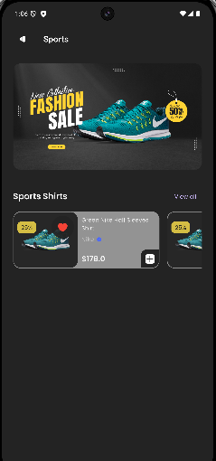

# 🛍️ BazaarLy - A Powerful eCommerce App

BazaarLy is a **modern eCommerce application** built with **Flutter** and **GetX**. It provides a seamless shopping experience with a variety of product categories, intuitive UI, and smooth navigation.

## 🚀 Features
✅ **Modern UI/UX** with smooth animations  
✅ **Product Categories** for easy browsing  
✅ **Product Listings & Details** with discounts  
✅ **Cart & Wishlist** to save products  
✅ **Search Functionality** to find items quickly  
✅ **User Authentication** (Login/Signup)  
✅ **Dark Mode Support**  

## 🛠️ Tech Stack
- **Flutter** for frontend UI development  
- **Dart** as the programming language  
- **GetX** for state management & navigation  
- **Firebase** for backend integration
## Screens
- 
- 
- 
- 
- 
- 
- 
- 
- 
- 
- 
- 
- 
-  

